# Architecture Diagrams

## 1. System Layer Architecture

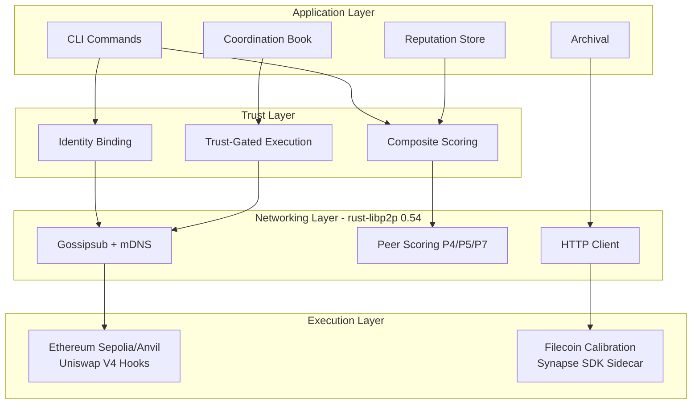

---

## 2. Trust Primitive Stack

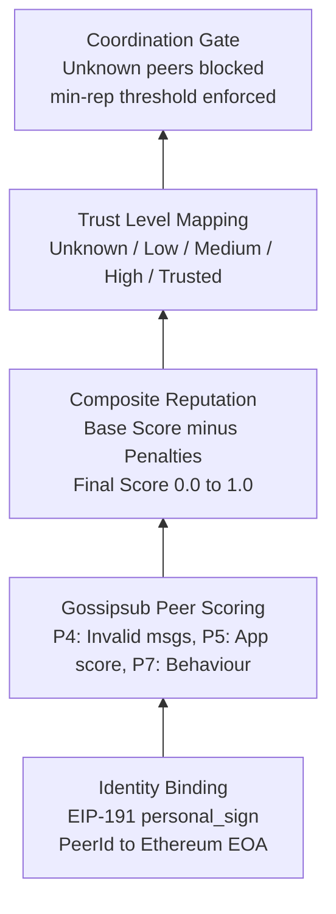

---

## 3. Reputation Scoring Pipeline

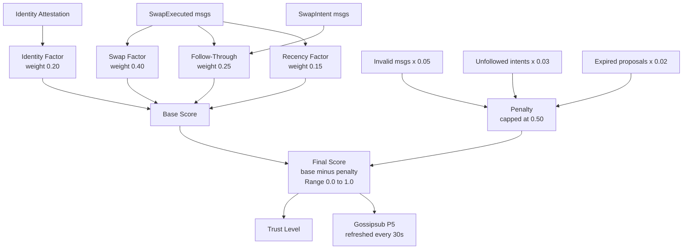

---

## 4. Gossipsub Peer Scoring

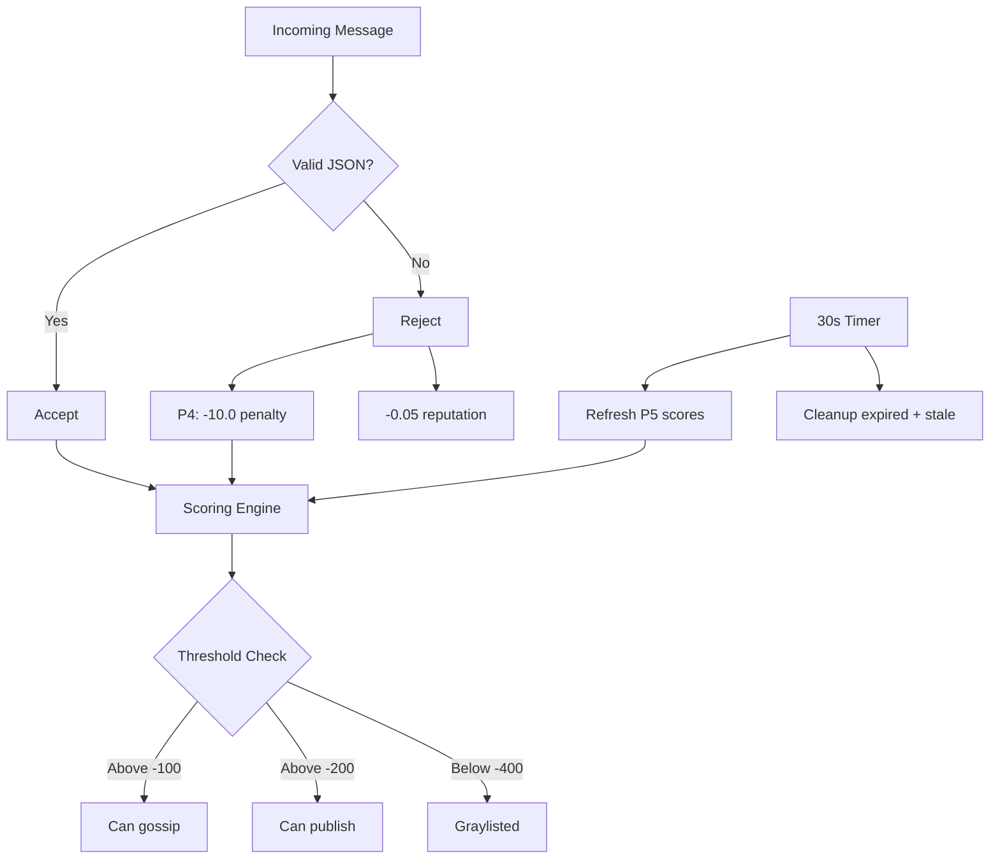

---

## 5. Coordination Protocol State Machine

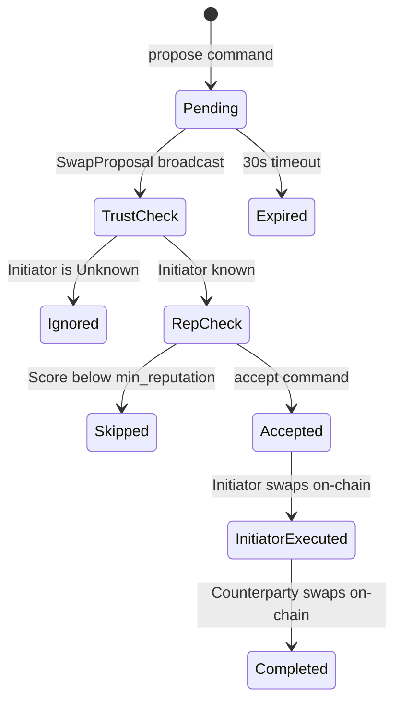

---

## 6. Message Types and Topics

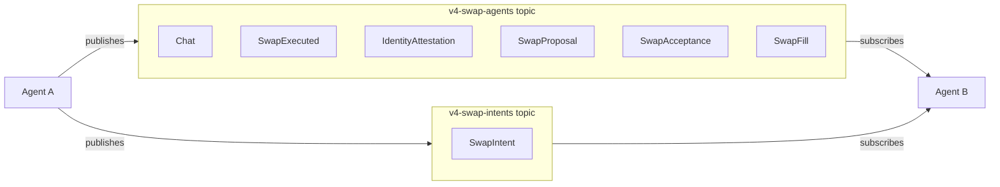

---

## 7. Execution Mode Pipeline

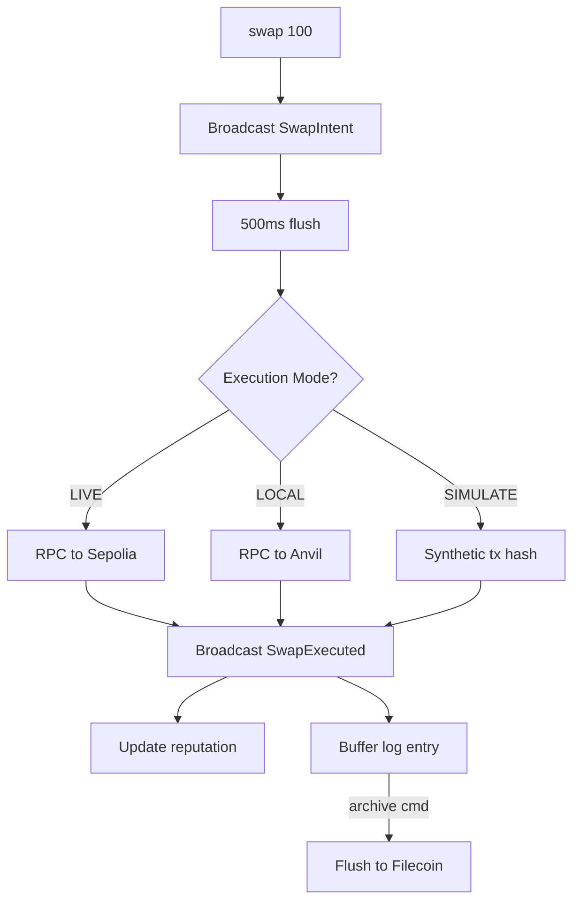

---

## 8. Module Dependency Graph

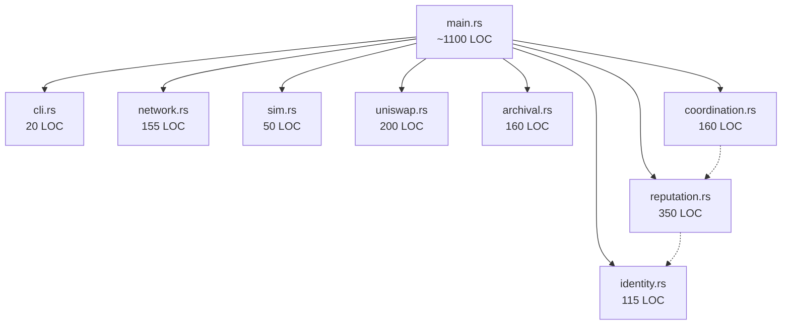

---

## 9. Identity Binding Flow

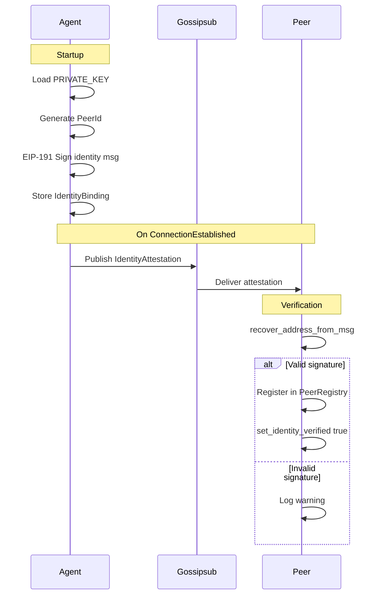

---

## 10. End-to-End Swap Flow

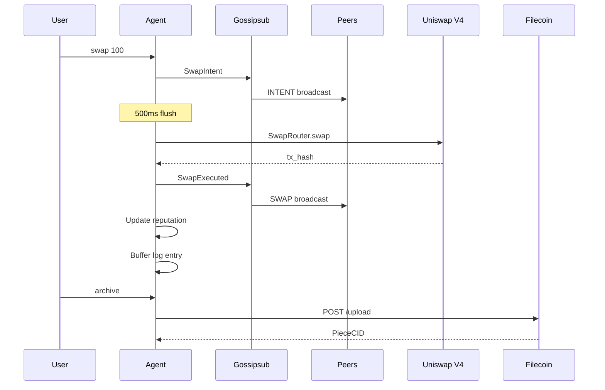

---

## 11. Two-Agent Coordination Flow

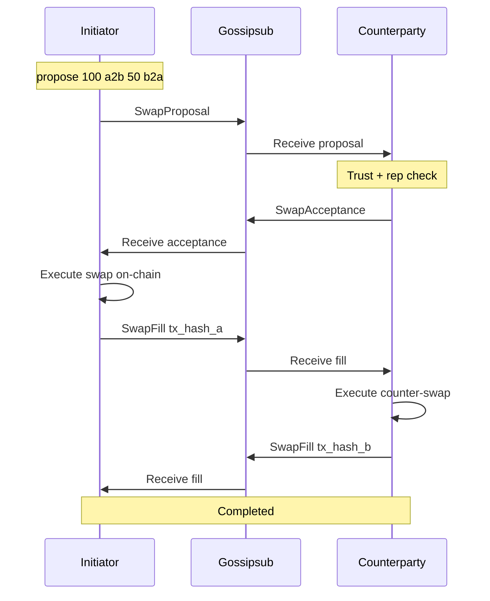

---

## 12. Periodic Score Refresh Cycle

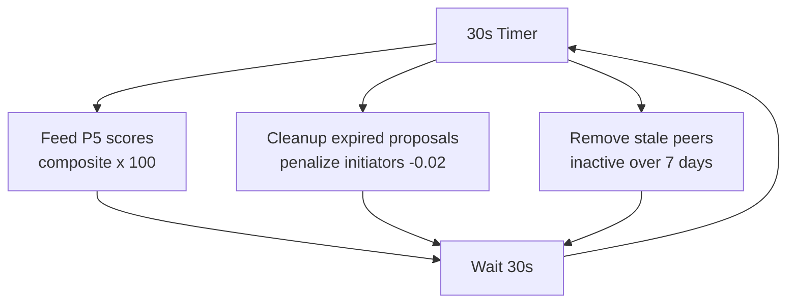
